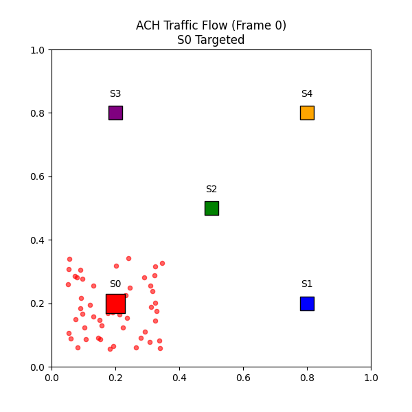

# Gradient Hashing
**A Locality-Aware Distributed Protocol for the AI Era.**

[](https://opensource.org/licenses/Apache-2.0)

> **TL;DR:** Consistent Hashing scatters data. Gradient Hashing groups it.
> This makes it ideal for **Edge Computing** (Geo-Locality) and **Vector Databases** (Semantic Locality).



## The Concept
Gradient Hashing replaces static mathematical lookups (e.g., Ring Hash, Maglev) with a dynamic **Physics-Based Flow Equation**.

Instead of assigning a key to a random bucket, Gradient Hashing calculates a "Gradient" of resistance based on two factors:
1.  **Gravity ($1/Distance^2$):** Pulls data to the closest server (Low Latency).
2.  **Pressure ($1/Capacity$):** Pushes data away from overloaded servers (Load Balancing).

This creates a "Liquid" system where traffic flows to the optimal node but naturally spills over to neighbors during spikes or failures.

## Why It Matters
Traditional Consistent Hashing faces an "Impossible Trade-off":
*   **Good Load Balance** = **Bad Locality** (Data scattered everywhere).
*   **Good Locality** = **Bad Load Balance** (Hotspots crash servers).

**Gradient Hashing solves both:**
*   **Locality:** Related data stays on the same or neighboring servers (Critical for RAG/Range Queries).
*   **Resilience:** If a node dies, traffic flows to physical neighbors, not random nodes.

## Simulation Results
We benchmarked Gradient Hashing against standard Ring Hashing with 10,000 requests.

| Metric | Ring Hashing (Standard) | **Gradient Hashing** |
| :--- | :--- | :--- |
| **Range Query Fan-out** | 5 Servers (Scatter) | **2 Servers** (Grouped) |
| **Latency / Hops** | High (Random) | **Minimal** (Nearest) |
| **Failure Recovery** | Global Rehash Storm | **Geometric Failover** |

## Usage
Run the simulation to see the load balancing in action:
```bash
python gradient_hash_sim.py
```

Run the visualizer to generate the comparison charts:
```bash
python gradient_hash_viz.py
```

Generate the animation (requires matplotlib/pillow):
```bash
python gradient_hash_animate.py
```

##  Origin Story
We drew inspiration from the famous **Tokyo Subway Experiment**, where a slime mold (*Physarum polycephalum*) recreated the efficient layout of the Tokyo rail network just by seeking food. We asked: *"Can we use this same 'biological flow' to route internet traffic?"*


## License

Apache License 2.0 - see [LICENSE](LICENSE) file for details.


##

**PS**: Sangeet's the name, a daft undergrad splashing through chemistry and code like a toddler—my titrations are a mess, and I've used my mouth to pipette. 
